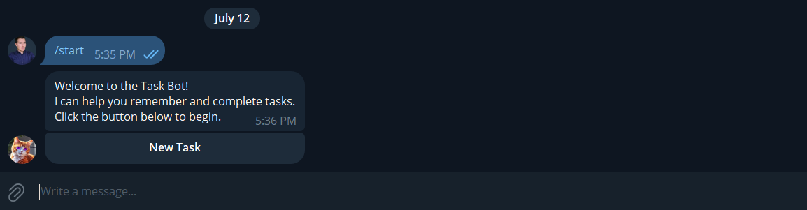
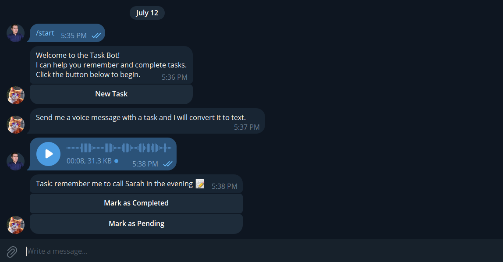
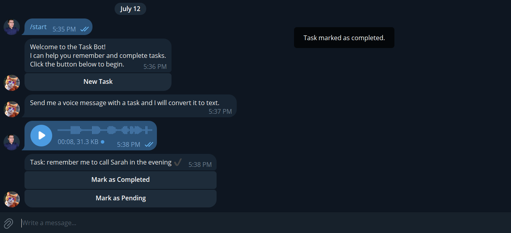

# Telegram Audio Task Bot

The **AI Telegram Audio Task Bot** is a bot developed using Python and the Telegram API. It utilizes OpenAI's natural language processing capabilities to convert voice messages into text and manage tasks through interactive buttons.

## 1. Features:

### a. Bot Operation:

- Clone the Repository
- Create .env File
- Install Dependencies
- Activate Virtual Environment
- Running the Bot

### b. Setup:

- Users can send questions to the bot.
- The bot requests the context in which to answer the question.
- Once the context is provided, the bot responds with the answer to the question.

## 1. Bot Operation:

### a. Initialization and Setup:

- The bot is initialized by sending the /start command in Telegram.
- Telegram API token and OpenAI API key must be configured in a .env file.

### b. Handling Voice Messages:

- Users can send voice messages containing tasks.
- OpenAI's speech recognition converts voice messages to text.

### c. Task Management:

- Tasks are stored internally with a status (neutral, completed, pending).
- Users can mark tasks as completed or pending using inline buttons.

## 2. Setup

### a. Clone the Repository:

    git clone https://github.com/netto14cr/IA_Telegram_task_Bot_03.git
cd AI_Telegram_ImageBot

### b. Create .env File:

- Create a .env file in the project root directory.
- Add your Telegram API token to the .env file.

        TELEGRAM_TOKEN=your_telegram_token_here
        OPENAI_API_KEY=your_openai_api_key_here

### c. Install Dependencies:
        python -m venv env
        source env/bin/activate  # For Linux/Mac
        .\env\Scripts\activate  # For Windows
        pip install -r requirements.txt

### d. Running the Bot:
        python ai_audio_task_bot.py

## 3. Example Usage

### Sending Tasks

#### 1. Sending a Task via Voice Message

- User sends a voice message with a task. The bot uses OpenAI to process the audio and converts it into text, displaying the task with options to mark as completed or pending.

        Task: Buy groceries: milk, eggs, bread. 📝
        
        Options:
        - Mark as Completed
        - Mark as Pending

### Interacting with Tasks
After receiving the task, users can interact with it using the provided options:

* Mark as Completed: Indicates that the task has been finished.
* Mark as Pending: Indicates that the task is still ongoing or needs further attention.

## 4. More information:

## 5. More information:
*This bot is for educational purposes and leverages OpenAI's capabilities for speech recognition and task management.*